# OpenWave for OpenDeck

An [OpenDeck](https://github.com/nekename/OpenDeck) plugin that puts
[OpenWave](https://github.com/rikkichy/openwave) on a Stream Deck: every mix,
every source and every send on a key or a dial, with the level, the mute and
which microphone has the floor visible without opening the mixer.

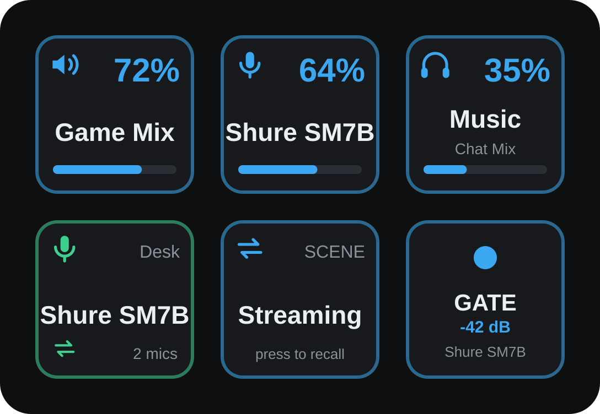

Linux only, Python only, no dependencies — it runs against whatever `python3`
the distribution ships.

## Actions

| Action | What the key shows | What pressing it does | Key | Dial |
| --- | --- | --- | :-: | :-: |
| **Mix Volume** | A mix's master level, or `MUTED` | Mutes, or steps up or down | ✓ | ✓ |
| **Source Volume** | A source's trim, applied in every mix at once | Mutes, or steps up or down | ✓ | ✓ |
| **Source Level per Mix** | One source inside a *single* mix, the mix named underneath | Mutes, or steps up or down | ✓ | ✓ |
| **Mic Group** | Which microphone in a group is live right now | Hands the group to its next microphone | ✓ | |
| **Scene** | The scene's name | Recalls it; optionally, a hold saves the current state into it | ✓ | |
| **Effect Toggle** | An LED for a microphone's low cut, gate, compressor or mono, with the threshold it applies | Flips that effect | ✓ | |

Every key draws itself from live state. A mute pressed anywhere — the
hardware button, OpenWave's window, another key — redraws the deck within
OpenWave's own debounce, not at the next refresh.

Only Mix Volume works with OpenWave closed: a mix master is a PipeWire sink,
so `pactl` reaches it directly. Everything else lives inside OpenWave, and its
keys go grey until the window is back.

### Volume keys and dials

Rotate a dial to adjust; a press mutes by default. **What a press does is
settable** — mute, turn up, or turn down — with a step size from 1% to 25%.
On a deck with no dials that is the difference between one key and three:
mute, louder and quieter on the same source.

The step is one setting, not two: a dial rotates by the same amount its press
steps, so the two cannot disagree. A key that steps says which way and by how
much, because three keys on one source are otherwise identical — they all
show the same level.

**Dials stack.** One dial can hold up to three targets; tapping the touch
strip cycles which one it drives. A dial with a single target keeps the tap as
a mute. The strip also carries a **live meter** under the volume bar, on the
same cube-root scale as OpenWave's own bars, polled only while a dial is
actually on screen.

"Turn Music down" means three different things, which is why there are three
volume actions:

| Action | What moves |
| --- | --- |
| **Source Volume** | Music, everywhere — every mix at once |
| **Source Level per Mix** | Music *in Chat only* — your own ears unaffected |
| **Mix Volume** | the whole Chat Mix, Music included |

One action per kind rather than one action with every target in a single list.
With three mixes and seven sources that list is **31 entries**, 21 of them
sends — long enough that finding a mix master at the top is work. Split, each
list is short, and OpenDeck's own action list says what a button does before
it is placed.

Source Level per Mix asks in **two dropdowns**, a source and a mix, because
that is genuinely two choices. One combined list is every pairing, and it
grows multiplicatively.

A key placed before the split keeps whatever it holds. Its action still drives
any kind, and a target its list would no longer offer is shown under
**Currently set** rather than vanishing, which would read as the key having
lost its setting.

### Mic Group

Hands a microphone group over to its next microphone: two mics on one
speaker, one press to swap. The key shows which microphone is currently live,
not which group it is bound to — the group is what you chose when you placed
it; which mic has the floor is what changes underneath you.

### Scene and Effect Toggle

A **Scene** key recalls a whole named setup in one press. With *hold to save*
on, holding it for more than 0.6 s writes the current state back into that
scene instead, and the key flashes `saved ✓` — a save changes nothing visible
anywhere else, so without it the gesture feels like it did nothing.

An **Effect Toggle** flips one effect on one microphone. The thresholds stay
with OpenWave's own popover and calibrator; the key only shows what it will
apply.

Every list is read live, never hardcoded. Rename a mix, add a source, make a
group or save a scene in OpenWave and the inspector shows it.

## What the keys look like

| Action | States | |
| --- | --- | --- |
| **Mix Volume** |  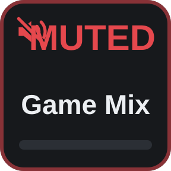 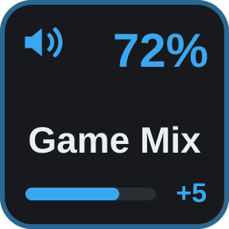 | live · muted · press steps up 5% |
| **Source Volume** | 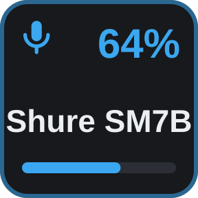  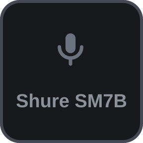 | live · muted · OpenWave closed |
| **Source Level per Mix** | 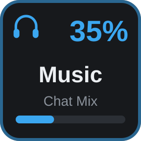  | live · muted |
| **Mic Group** | 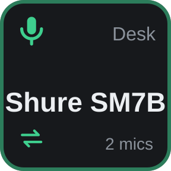 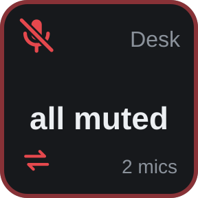 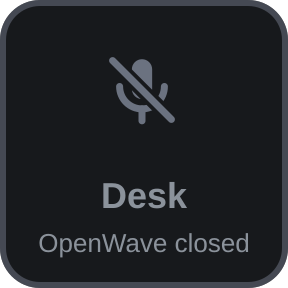 | a mic live · all muted · OpenWave closed |
| **Scene** | 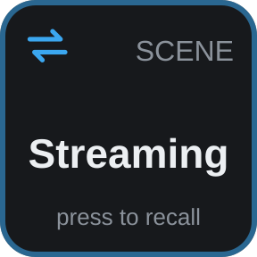 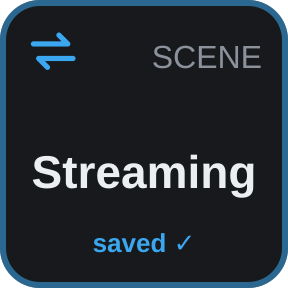 | ready · just saved by a hold |
| **Effect Toggle** | 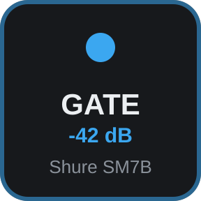 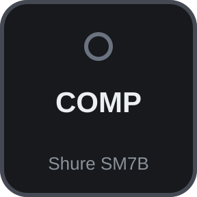 | on, with its threshold · off |
| **Dial strip** | 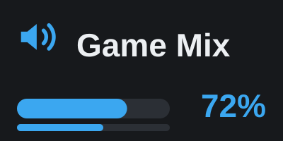 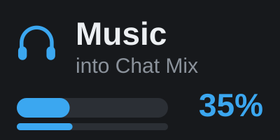 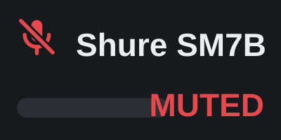 | mix with meter · send · muted |

Six palettes ship — Default, Amber, Violet, Monochrome, High contrast and
Light — chosen from any of the property inspectors:

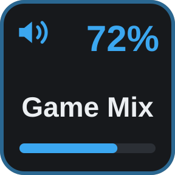 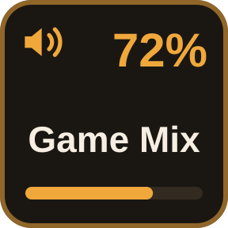 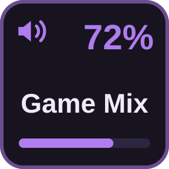 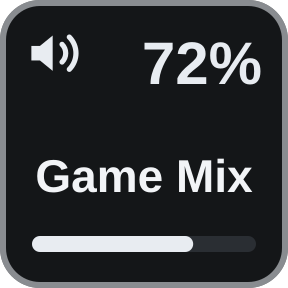 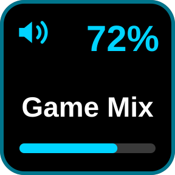 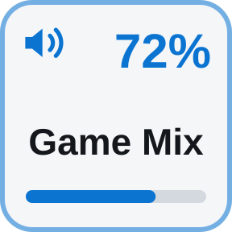

These are drawn by the plugin's own renderer (`make preview`), not mocked up.

The colour is the state: one hue for a normal level, **another for muted**
(with the glyph struck through), **a third for the microphone that currently
has the floor**. Long names wrap to a second line rather than truncating —
"Arctis Nov…" identifies nothing.

A theme is the whole palette, not an accent: recolouring one hue would leave
Light unreadable, white text on a white ground. It applies plugin-wide rather
than per key, because one key in Amber among five in Default reads as broken
rather than customised.

### How the keys are drawn

Keys are drawn as SVG and sent with `setImage`; OpenDeck bundles resvg, so
they render as vectors at any panel size. The state is continuous and
combinatorial — a name, a level, a mute, and for a group, which of several
microphones is open — and baking that into static images would need one file
per combination.

Encoders use **`layouts/strip.json`**, a layout of our own holding exactly one
pixmap item across the whole 200×100 strip, so it is drawn the same way a key
is instead of being assembled from a title slot, a cramped 48×48 icon and a bar
that cannot be moved.

None of the built-in layouts will do, including `$A0` — which does expose a
full-canvas pixmap, but carries a title item and a second canvas alongside it,
and OpenDeck draws **both over the top**: the title falls back to the action's
name rather than staying empty when set to `""`, and the unset canvas paints a
transparency checkerboard across the middle. A layout with one item cannot do
either.

Encoders are also sent **no** `setImage` — OpenDeck routes a key image into the
layout's icon slot, which puts a shrunken copy of an entire key inside the
strip.

## How it talks to OpenWave

Two different jobs, two different mechanisms, and the split is deliberate.

Anything PipeWire owns is done directly with `pactl`. Anything **OpenWave**
owns goes through it, over the session bus. Its mixer holds the same state the
window holds and rewrites its config whole on every save, so a value written
from outside is discarded the moment a slider moves; and its GUI holds the
only USB handle the firmware will serve.

The bus side needs no protocol of its own: `GApplication` already exports
`org.gtk.Actions` on `com.github.openwave`, so OpenWave registers actions and
this calls them.

```
gdbus call --session --dest com.github.openwave \
  --object-path /com/github/openwave \
  --method org.gtk.Actions.List
```

| OpenWave action | Used by |
| --- | --- |
| `snapshot` | every key — name, level, mute, group and live mic in one read |
| `set-source-level`, `toggle-source-mute` | Source Volume |
| `set-cell-level`, `toggle-cell-mute` | Source Level per Mix |
| `switch-group`, `source-groups` | Mic Group |
| `scenes`, `apply-scene`, `save-scene` | Scene |
| `toggle-fx` | Effect Toggle |
| `levels` | the live meter on a dial strip |

`snapshot` is one action rather than one per field: a button has to draw all of
it at once, and reading that piecemeal would let the parts disagree mid-read.
`Activate` has no reply, so the pair is refresh-then-`Describe`.

The plugin subscribes to `org.gtk.Actions.Changed` and pumps the GLib context
from its own select loop, so a change made anywhere is pushed to the deck.
Polling remains as the fallback for an interpreter without `gi`.

Preferred transport is GObject introspection, which hands back real GVariants
so the JSON snapshot survives with its quoting intact; `gdbus` is the fallback
for the fire-and-forget calls when `gi` is not importable.

Sends go through the window rather than into `mixes.json` because OpenWave
re-applies `send × trim` on every reconcile, so a cell written directly is
undone within a second. Going through the window is not a nicety, it is the
only thing that sticks.

Device gain is still absent, and stays that way while the GUI holds the USB
handle — the firmware serves one process at a time.

## Requirements

| Dependency | Needed for | Notes |
| --- | --- | --- |
| Linux with PipeWire | everything | `pactl` from `pipewire-pulse` drives the mix masters |
| [OpenDeck](https://github.com/nekename/OpenDeck) | everything | Must run **unsandboxed** (AppImage or native package, not Flatpak). The Flatpak has no access to `pactl` or the session's PipeWire |
| `python3` 3.10+ at `/usr/bin/python3` | everything | The system interpreter. Standard library only, so there is nothing to `pip install` |
| [OpenWave](https://github.com/rikkichy/openwave), running | every action but Mix Volume | A build that exports the actions above on the session bus |
| PyGObject (`python-gobject`) | instant updates | Optional. Without it the plugin falls back to `gdbus` and polls |

## Install

### From a release

1. Download `openwave-streamdeck-X.Y.Z.zip` from the
   [latest release](https://github.com/NyleGarcia/openwave-streamdeck/releases/latest).
   Check it against the `.sha256` file next to it with `sha256sum -c`.
2. Install it with OpenDeck's install-from-file option in the Plugins view, or
   by hand:
   ```sh
   unzip openwave-streamdeck-*.zip -d ~/.config/opendeck/plugins/
   ```
3. Restart OpenDeck and drag an action from **OpenWave** onto a key or dial.

### From source

```sh
git clone https://github.com/NyleGarcia/openwave-streamdeck.git
cd openwave-streamdeck
make install     # copies the bundle into ~/.config/opendeck/plugins
```

Then restart OpenDeck. It is a copy, not a symlink, so run `make install`
again after each change. To build the archive OpenDeck's installer takes:

```sh
make package     # dist/openwave-streamdeck-<version>.zip (+ .sha256)
```

### Uninstall

```sh
rm -rf ~/.config/opendeck/plugins/dev.openwave.sdPlugin
```

## Troubleshooting

**Every key but Mix Volume is grey.** Those actions go through
OpenWave's window over D-Bus, so it has to be running in the same session.
Check with the `gdbus … org.gtk.Actions.List` call above; if it lists nothing,
the OpenWave build predates the actions this plugin calls.

**Nothing works at all, not even Mix Volume.** OpenDeck is probably running as
a Flatpak. The sandbox hides `pactl` and PipeWire from the plugin. Use the
AppImage or a native package instead — [`MIGRATE-OPENDECK.md`](MIGRATE-OPENDECK.md)
walks through moving an existing setup across.

**The plugin dies at start under the AppImage.** `run.sh` scrubs the
AppImage's injected `PYTHONHOME`, `PYTHONPATH` and `LD_LIBRARY_PATH` before
exec'ing the system Python; without that the interpreter looks for its
standard library inside the AppImage and aborts before running a line. If the
keys are blank, check the plugin was installed with its `run.sh` still
executable.

**Keys update a second late.** PyGObject is not importable by
`/usr/bin/python3`, so the plugin is polling instead of listening for
OpenWave's `Changed` signal. Install `python-gobject` (Arch) or
`python3-gi` (Debian/Ubuntu).

**An inspector is empty.** See [Debugging](#debugging) — the inspector reports
what it rendered into the plugin's log.

**Where are the logs?** The plugin writes
`~/.config/opendeck/plugins/dev.openwave.sdPlugin/plugin.log`. Start OpenDeck
with `OPENWAVE_DECK_DEBUG=1` for the full event firehose.

## Development

```sh
make check       # bundle validation, byte-compile, shell syntax, tests
make test        # tests only
make package     # build the release zip and its checksum into dist/
make preview     # redraw the README images from the key renderer
```

The tests are stdlib `unittest` with no dependencies, and run with no deck,
no PipeWire and no OpenWave.

`scripts/validate_plugin.py` is the part worth having: OpenDeck fails a broken
plugin *quietly*. A missing property inspector gives an empty panel, a missing
layout gives a blank touch strip, and neither writes anything to any log. The
validator resolves every path the manifest names — inspectors, layouts, icons,
each state image, every module the entry point imports — so a bundle that would
fail silently on a deck fails loudly in CI instead.

Node ids are resolved by `node.name` on every use, never cached: they are
reassigned whenever a node reappears, and OpenWave destroys and recreates its
sinks whenever mixes are installed.

Nothing in `plugin.py` may raise to the top level. OpenDeck does not restart a
plugin that dies — the keys just stop responding, with nothing to say why.

### Layout

```
dev.openwave.sdPlugin/
  manifest.json     actions, icons, the property inspectors
  run.sh            env scrub, then /usr/bin/python3
  plugin.py         event loop; one process, no dependencies
  owdeck/ws.py      stdlib RFC 6455 client
  owdeck/graph.py   pactl wrappers
  owdeck/owstate.py read-only readers for OpenWave's JSON
  owdeck/ipc.py     org.gtk.Actions calls into a running OpenWave
  owdeck/render.py  the SVG the keys are drawn from
  layouts/          the encoder strip layout
  pi/               property inspectors
scripts/            validator, packager, version writer, preview renderer
tests/              stdlib unittest suite
```

### Debugging

A property inspector runs in a webview inside a Tauri window, where nothing can
read its console — so it reports what it did back to the plugin, which has a
log file:

```
PI[sd-…Encoder.0.0] payload 833b
PI[sd-…Encoder.0.0] rendered 11 options, 3 groups, chosen=none, visible=true
```

Uncaught errors are reported the same way. Set `OPENWAVE_DECK_DEBUG=1` in
OpenDeck's environment for the full event firehose in `plugin.log`; without it
only the inspector reports and real errors are logged.

`pi/` pages can also be driven outside OpenDeck entirely — WebKitGTK is the
same engine the panel runs in, so loading one with a stubbed socket shows
exactly what the page builds.

### Writing a property inspector

The context to send on is **`inActionInfo.context`** — the action's context,
not the inspector's own uuid. Sending the uuid is accepted by the socket and
then routed nowhere: settings are never saved, the plugin is never asked for
its lists, and the panel sits empty with nothing in any log to explain it.
`pi/_shared.js` handles that, and both connect conventions OpenDeck ships.

Asking once is also not enough. The panel's webview is built well before anyone
looks at it — often ten seconds before — so the panel retries until it gets an
answer, and the plugin **pushes** the lists on `propertyInspectorDidAppear`,
which fires at the only moment they are actually being read.

## Releasing

Versioning is [semantic-release](https://semantic-release.gitbook.io/) driven
by [Conventional Commits](https://www.conventionalcommits.org/) (Angular
preset) on `main`:

| Commit prefix | Bump |
| --- | --- |
| `fix:` | patch |
| `feat:` | minor |
| `polish:` | patch |
| `BREAKING CHANGE:` in the body | major |
| `chore:`, `docs:`, `refactor:`, `test:`, `build:`, `ci:` | none |

A release writes the version into `dev.openwave.sdPlugin/manifest.json` as well
as tagging — the manifest is the only place a version is visible to someone
using the plugin — updates [`CHANGELOG.md`](CHANGELOG.md), and attaches the
installable zip and its `.sha256` to the GitHub release. `next` publishes
prereleases; the manifest gets only their `MAJOR.MINOR.PATCH`, since it has no
field for a prerelease tag.

The zip contains the `dev.openwave.sdPlugin` directory *at its root*, which is
what OpenDeck's installer expects; a zip of that directory's contents installs a
plugin with no manifest where one should be. It is built with Python's
`zipfile`, keeping `run.sh` executable and leaving out bytecode and logs.

## Status

Volume, Mic Group, Scene and Effect Toggle work, on keys and — for the volume
actions — on dials. Device gain and per-mix output selection need more actions
on OpenWave's side first.

## License

MIT — see [LICENSE](LICENSE).

The plugin drives OpenWave as a separate process, through its D-Bus actions,
and contains none of its code.
